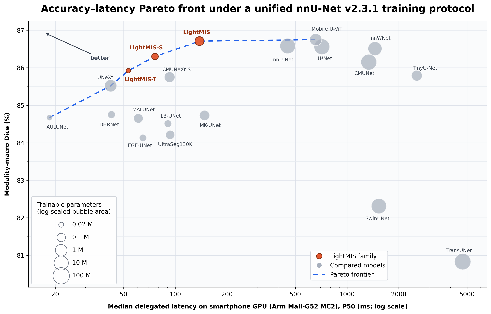

# LightMIS: Ultra-Lightweight Medical Image Segmentation Without a Stage-Wise Decoder

[](https://arxiv.org/pdf/2609.28327)
[](https://huggingface.co/papers/2609.28327)


[Andrei Arhire](https://scholar.google.com/citations?user=BYkEZGFPq1wC&hl=en), [Mihaela Breaban](https://scholar.google.com/citations?user=i6CD3TIAAAAJ&hl=en), [Radu Timofte](https://scholar.google.com/citations?user=u3MwH5kAAAAJ&hl=en)


LightMIS employs a compact multi-scale encoder in which an Adaptive Fusion Cascade (AFC) processes features at every spatial scale. Each AFC combines AKF-based preprocessing, the proposed Progressive Receptive Fusion (PRF) module, and residual AKF refinement. PRF enriches narrow feature representations through temporary channel expansion, complementary depthwise receptive fields, and progressive cross-branch information transfer. For narrow-channel configurations, a conventional decoder introduces costly repeated upsampling and stage-wise encoder–decoder fusion. LightMIS therefore replaces it with a compact aggregation head: Scale-Aligned Projection (SAP) blocks process and align the output of every encoder level to a common resolution and channel width, after which the aligned features are fused and refined by a final AFC.



Evaluated under a common nnU-Net v2.3.1 protocol using five-fold cross-validation on six datasets spanning five imaging domains of 2D binary medical image segmentation, LightMIS achieves closely matched observed modality-macro performance on region-overlap metrics, together with competitive boundary-distance results relative to substantially larger models, including Mobile U-ViT, nnWNet, and nnU-Net. At the same time, LightMIS uses 90.58–99.61% fewer parameters and requires 82.54–96.14% fewer GFLOPs than these models. On a smartphone equipped with an Arm Mali-G52 MC2 GPU, all LightMIS variants achieve full GPU delegation (100% GPU operator coverage), with median delegated latency ranging from 53.31 ms for LightMIS-T to 138.31 ms for LightMIS.

## How to Use

- Install and configure [**nnU-Net**](https://github.com/MIC-DKFZ/nnUNet). The experiments in this repository use nnU-Net v2.3.1.

- Download the following datasets:

   - [**DRIVE**](https://www.kaggle.com/datasets/zionfuo/drive2004)
   - [**Kvasir-SEG**](https://datasets.simula.no/kvasir-seg/)
   - [**DSB18**](https://www.kaggle.com/competitions/data-science-bowl-2018/data)
   - [**BUSI**](https://www.kaggle.com/datasets/sabahesaraki/breast-ultrasound-images-dataset/data)
   - [**ISIC-2017**](https://challenge.isic-archive.com/data/#2017)
   - [**ISIC-2018**](https://challenge.isic-archive.com/data/#2018)

- Convert each dataset to the nnU-Net raw-data format using the provided [**dataset-conversion scripts**](scripts/data_conversion).


- Run nnU-Net planning and preprocessing for the 2D configuration:

   ```bash
   nnUNetv2_plan_and_preprocess -d 100 --verify_dataset_integrity -c 2d
   ```
   The exact [**five fold partitions and nnU-Net plan files**](configs/nnunet) used in the experiments are provided for reproducibility.

- Move **nnUNetTrainer_LightMIS.py** to **.../nnUNet/nnunetv2/training/nnUNetTrainer/** of the configured nnUNet

- Train LightMIS using five-fold cross-validation:

```bash
CUDA_VISIBLE_DEVICES=0 nnUNetv2_train 100 2d 0 -tr nnUNetTrainer_LightMIS && \
CUDA_VISIBLE_DEVICES=0 nnUNetv2_train 100 2d 1 -tr nnUNetTrainer_LightMIS && \
CUDA_VISIBLE_DEVICES=0 nnUNetv2_train 100 2d 2 -tr nnUNetTrainer_LightMIS && \
CUDA_VISIBLE_DEVICES=0 nnUNetv2_train 100 2d 3 -tr nnUNetTrainer_LightMIS && \
CUDA_VISIBLE_DEVICES=0 nnUNetv2_train 100 2d 4 -tr nnUNetTrainer_LightMIS
```

- After all five folds have been trained, nnU-Net automatically saves the validation predictions generated for each fold.

- Pretrained [**checkpoints**](checkpoints) are also provided and can be used to run inference on data preprocessed with nnU-Net.

- Additional reproducibility resources:

  - The exact [**baseline commit hashes**](BASELINE_COMMITS.md) used in the experiments.
  - The [**metric implementation, FLOP-counting, LiteRT conversion, and desktop and mobile benchmarking scripts**](scripts).


## Citation

If you find our work useful or inspiring for your research, please cite our paper:


## Acknowledgments

We thank the authors of the compared methods for making their work publicly available.
In particular, we acknowledge [AULUNet](https://github.com/maklachur/AULUNet) for the original AKF design.

This work was supported by the European Regional Development Fund under Grant No. 338317 (SMIS code).

## Contact

andrei.arhire@info.uaic.ro

